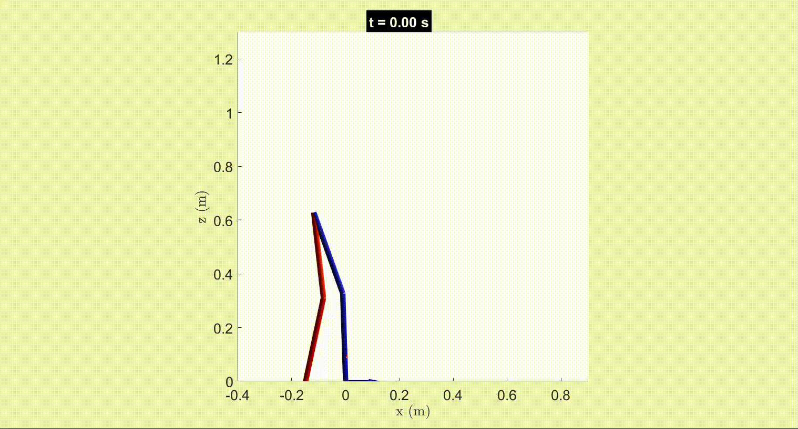

# HelloWorld

This optimization package is developed based on TROPIC [1] that optimize the walking gaits composed of alternation of single support phase on rigid ground.

## The major modifications are followings:
1. Optimazing walking gaits on compliant ground.
2. The walking gaits is composed of double support phase and sigle support phase as seen the above picture.

Currently, the compliant ground are modeled by the spring damper model:

Nonlinear and rigid contact models will be supported soon.

[1] [[Link]](https://github.com/fevrem/TROPIC/blob/master/MF_PMW_JPS_IROS2020_TROPIC.pdf) M. Fevre, P. M. Wensing, and J. P. Schmiedeler, "Rapid Bipedal Gait Optimization in CasADi", in Proc. IEEE/RSJ International Conference on Intelligent Robots and Systems (IROS), 2020, pp. 3672-3678.

